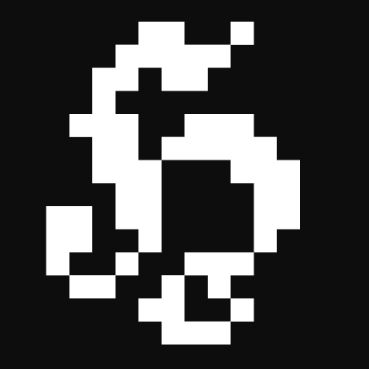

We are a small indie studio based on the <strong>Canary Islands</strong>, in Spain. Our goal is to create <strong>short yet delightful experiences</strong> that convey ideas or explore mechanics&nbsp;rarely pondered&nbsp;before.

<blockquote>Reality is broken. Game designers can fix it.</blockquote>
<h4>Our team</h4>

&nbsp;<strong><a href="https://github.com/h3nry-d1az" target="_blank">Henry Díaz Bordón</a>:</strong>&nbsp;Lead coder and designer.

<h4>Open Source initiative</h4>

We are utterly devoted to the Open Source movement, and thus we try to make most of our projects' code available for everyone, so you know what's going on behind the scenes. Stay tuned for more information on our new games and code releases.

